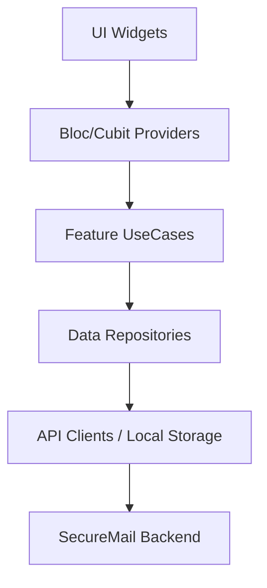

# SecureMail Flutter

A cross-platform mobile client for SecureMail.

## 🛡️ Deep Analysis: Mobile Security UX

SecureMail-Flutter is a high-performance cross-platform application designed to brind the SecureMail SOC experience to mobile devices.

### ⚙️ Clean Architecture
The app follows a strict **Feature-First Architecture**, ensuring that business logic is decoupled from the UI layer.



### 🔍 Core Features
- **Real-time Push Notifications**: Instant alerts when high-severity threats are detected.
- **Visual Analysis Reports**: Interactive charts and data visualizations showing why an email was flagged.
- **One-Tap Actions**: Respond to or block threats directly from the notification shade.

### 🛠️ Tech Stack
- **Framework**: Flutter 3.x
- **Language**: Dart
- **State Management**: BLoC / Provider
- **Networking**: Dio with OpenAPI-generated clients.

---

## ✅ Run Options

### 1. Via Turborepo (Root)
To build the web version:
```bash
npm run dev:flutter
```

### 2. Manual Execution
1. **Dependencies**:
   ```bash
   flutter pub get
   ```
2. **Run**:
   ```bash
   flutter run
   ```

---

## 🏗️ Architecture
- **State Management**: Riverpod.
- **Networking**: Dio (pointing to Backend API on port 3000).
- **Navigation**: go_router.
